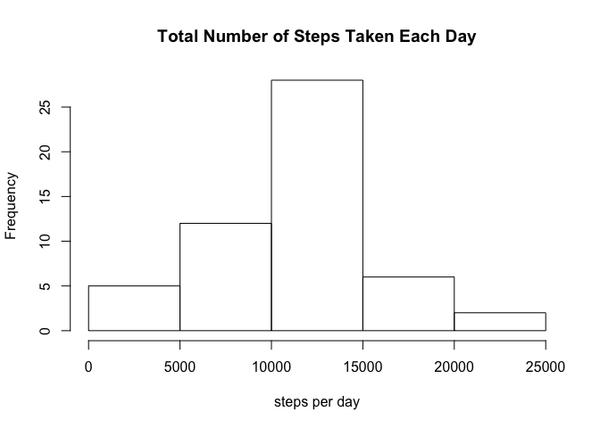
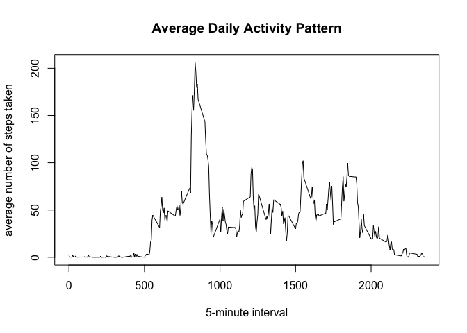
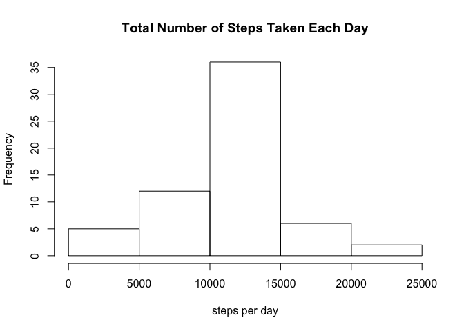
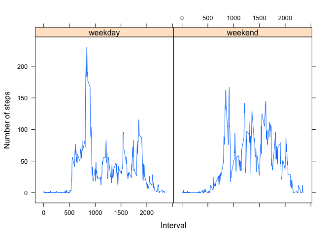

# Reproducible Research: Peer Assessment 1
  
  
### Loading and preprocessing the data
Unzip the data.

```r
unzip("activity.zip")
```
  
Read and format the data.

```r
data <- read.csv("activity.csv", header=TRUE, sep=",", na.strings="NA")
data$date <- as.Date(as.character(data$date), "%Y-%m-%d")
```

### What is mean total number of steps taken per day?
Ignore the missing values in the dataset.

```r
dataNoNa <- data[!is.na(data$steps), ]
```
  
Calculate the total number of steps taken per day.

```r
stepsPerDay <- aggregate(steps~date, dataNoNa, sum)
```
  
Make a histogram of the total number of steps taken each day.

```r
hist(stepsPerDay$steps, main="Total Number of Steps Taken Each Day", xlab="steps per day")
```

 
  
Calculate and report the mean and median of the total number of steps taken per day.

```r
options(scipen = 1)
mean(stepsPerDay$steps)  
```

[1] 10766.19

```r
median(stepsPerDay$steps)  
```

[1] 10765

### What is the average daily activity pattern?
Make a time series plot of the 5-minute interval (x-axis) and the average number  
of steps taken, averaged across all days (y-axis).

```r
averageSteps <- aggregate(steps~interval, dataNoNa, mean)
plot(averageSteps, type="l",
     xlab="5-minute interval", 
     ylab="average number of steps taken", 
     main="Average Daily Activity Pattern")
```

 
  
Which 5-minute interval, on average across all the days in the dataset,  
contains the maximum number of steps?

```r
averageSteps[which.max(averageSteps$steps), ]
```

```
##     interval    steps
## 104      835 206.1698
```
  
### Imputing missing values
Calculate and report the total number of missing values in the dataset.

```r
sum(is.na(data$steps))
```

```
## [1] 2304
```
  
Strategy for filling in all of the missing values in the dataset:  
Use the mean for that 5-minute interval.

```r
naSubset <- data[which(is.na(data$steps)), 3]
fillMissing <- sapply(naSubset, function(x) {
        averageSteps[(averageSteps$interval == x), 2]
})
newData <- data
newData[which(is.na(newData$steps)), "steps"] <- fillMissing
```
  
Make a histogram of the total number of steps taken each day with the new dataset.

```r
stepsPerDay <- aggregate(steps~date, newData, sum)
hist(stepsPerDay$steps, main="Total Number of Steps Taken Each Day", xlab="steps per day")
```

 
  
Calculate and report the mean and median total number of steps taken per day  
with the new dataset.

```r
options(scipen = 1)
mean(stepsPerDay$steps)  
```

[1] 10766.19

```r
median(stepsPerDay$steps)  
```

[1] 10766.19
  
The mean number of steps taken per day did not change, but the median number of  
steps taken per day increased such that now the mean and median are equal.
  
### Are there differences in activity patterns between weekdays and weekends?
Create a new factor variable in the dataset with two levels – “weekday” and  
“weekend” indicating whether a given date is a weekday or weekend day.

```r
newData["wknd"] <- factor(sapply(newData$date, function(x) {
        if (weekdays(x) == "Sunday" | weekdays(x) == "Saturday") {
                "weekend"
        } else {
                "weekday"
        }
}))  
```
  
Make a panel plot containing a time series plot of the 5-minute interval (x-axis)  
and the average number of steps taken, averaged across all weekday days or  
weekend days (y-axis).

```r
library(lattice)
newAverageSteps <- aggregate(steps ~ interval + wknd, newData, mean)
xyplot(steps ~ interval | wknd, data = newAverageSteps, type = "l", layout = c(2, 
    1), xlab = "Interval", ylab = "Number of steps")
```

 
